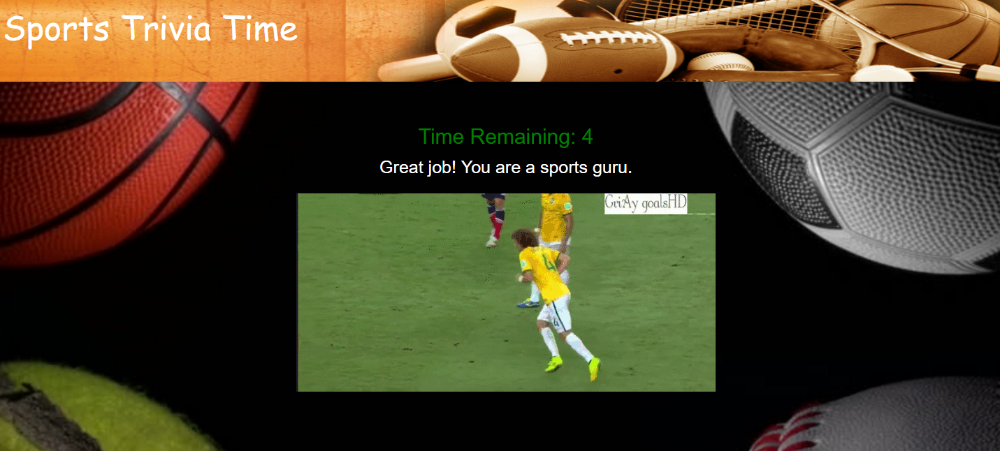
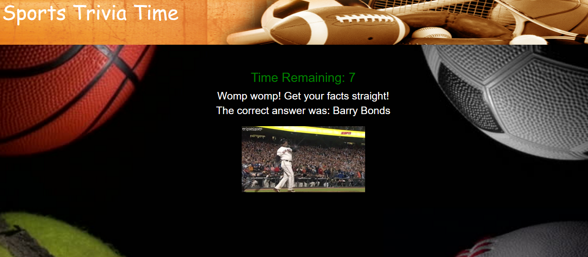

# :basketball:  Sports TriviaGame  :football:

Created during Week 5 of Rutgers Coding Bootcamp. The challenge was to create a timed trivia game. Each user is allowed 10 seconds to answer the questions. If the user guesses correctly then the site will display a success message. However if the player guesses incorrectly it will display the correct answer. At the end of each question a gif appears. Once the player has complete all the questions, the site will display counts all correct, incorrect, and unanswered questions. 

## Motivation

Homework assignment first and foremost but besides that I enojoy a variety of sports so I decided to make it a sports themed trivia game.

## Getting Started 
Play here: https://ma-trivia.herokuapp.com/

## Screenshots

### Home Page


### Correct Answer


## Incorrect Answer


### Scoreboard


## Technologies used
- Google Fonts
- Bootstrap
- jQuery

### Prerequisites

```
- Bootstrap: visit http://getbootstrap.com/getting-started/ for the CDN and link in html
- jQuery: visit http://code.jquery.com/ and link in html
```

## Built With

* Sublime Text - Text Editor
* Bootstrap- Wireframe

## Authors

**Muhammet Aydin** - *HTML/CSS/JS* - [Muhammet Aydin](https://github.com/muhammeta7)